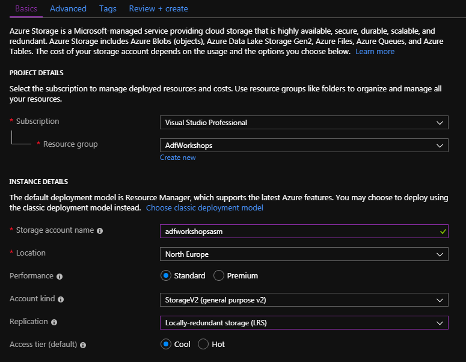
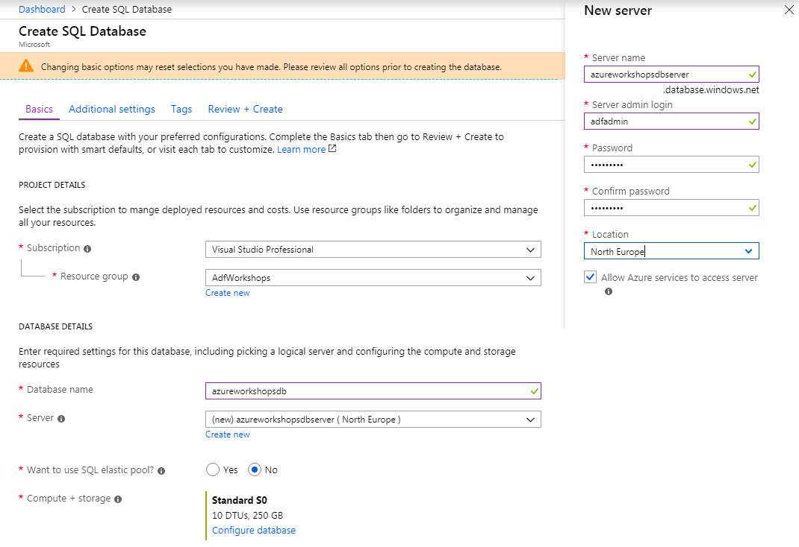
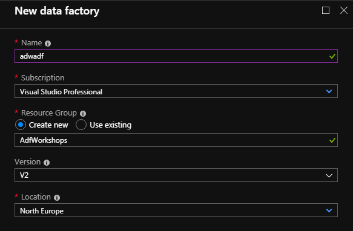

# Zadanie 1

## Stworzenie usługi Azure Storage Account

- Stwórz usługę Azure Storage Account
  - Azure -> Create a resource -> Storage -> Storage account -> Create . Najlepiej na potrzeby szkolenia stwórz osobną grupę zasobów. Jako rodzaj konta wybierz **StorageV2**, natomiast w sekcji replikacja **Locally-redundant storage (LRS)**:

## Stworzenie usługi Azure SQL Database

- Stwórz usługę Azure SQL Database
  - Azure -> Create a resource -> Databases -> SQL Database -> Create . W trakcie tworzenia usługi konieczne będzie stworzenie nowego serwera baz danych:

## Utworzenie usługi Azure Data Factory

- Stwórz usługę Azure Data Factory
  - Azure -> Create a resource -> Data Factory -> Create . Najlepiej na potrzeby szkolenia stwórz osobną grupę zasobów. Jako wersję Data Factory wybierz V2.

