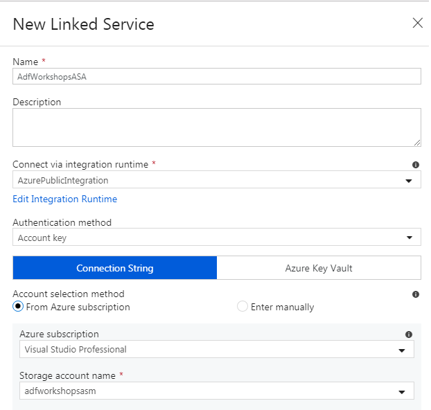

# Zadanie 2

## Wgranie pliku z danymi na Azure Storage Manager

Przejdź do poratlu Azure, a następnie wybierz niedawno stworzony magazyn danych. Następnie kliknij w sekcję **Blobs** i dodaj nowy kontener o prywatnym dostępie nazywając go **parking**. Otwórz kontener, a następnie klinik w przycisk **upload**, aby wgrać plik *.csv z danymi.


## Data Factory UI

Przejdź od usługi Azure Data Factory. W sekcji **Overview** kliknij w przycisk **Author & Monitor**:


W nowej karcie przeglądarki zostaniemy przekierowani do webowego designera Azure Data Factory:


Azure Data Factory może poprosić o adres repozytorium git'owego. Na potrzeby szkolenia, gdzie ADF wykorzystywany będzie eksperymentalnie. W przypadku wykorzystywania go w projekcie zaleca się integrację z dowolnym repozytorium gitowym, np.[GitHubem](https://azure.microsoft.com/en-us/blog/azure-data-factory-visual-tools-now-supports-github-integration/) .

## Konfiguracja Dataset'u Azure Storage Account

Aby stworzyć dataset wybieramy ikonkę ołówka (author) znajdującą się po lewej stronie. Następnie klikamy w ikonkę plusa i wybieramy **Dataset**. Po prawej stronie powinien wysunąć się dodatkowy panel z wszystkimi dostępnymi źródłami, aktualnie wspieranymi przez ADF. Naszym zadaniem jest przekopiowanie danych z pliku *.csv, znajdującym się na magazynie danych, do bazy danych Azure SQL Server. Aby odfiltrować listę dostępnych źródeł wybierz zakładkę **Azure**, a następnie **Azure Blob Storage**:


Następnie nazwij swój dataset, np. **ParkingASADataSet** i przejdź do zakładki **Connection**. Koniecznym będzie stworzenie tzw. **Linked service** za pomocą którego będziemy mogli połączyć się do magazynu danych. Kliknij w plus z napisem **New** znajdujący się po prawej stronie. Magazyn danych podlinkujemy za pomocą **Connection Stringa**. Właściwe konto magazynu powinno być widoczne po wybraniu właściwej subskrypcji:



Na samym dole znajduje się przycisk **Test connection**, sprawdzający jakość połączenia z magazynem.
Kiedy **Linked service** zostanie już podłączony do dataset'u możliwe będzie wskazanie na konkretny kontener oraz plik z danymi (przycisk **Browse**). Jako **Compression type** zostawiamy **None**. Przy pomocy przycisku **Preview data** możesz podejrzeć swój dataset:


Poprawnie skonfigorowane połączenie powinno wyglądać następująco:


W zakładce **Schema** można zaimportować domyślą schemę dla danych lub nieco ją zmodyfikować.

Aby zapisać skonfigurowany dataset kliknij w zakładkę **Publish All**.

## Konfiguracja Dataset'u Azure SQL Database

Na podstawie instrukcji zawartej powyżej stwórz drugi dataset, tym razem dla bazy danych Azure SQL Databse. W ramach tego zadania konieczne będzie dodanie nowej tabeli do przechowywania załadowanych danych. Pamiętaj, żeby przy importowaniu schemy usunąć wszelkie atrybuty pełniące rolę klucza - powinny być one uzupełniane automatycznie.

Skrypt SQL do stworzenia tabeli:

```sql
CREATE TABLE [dbo].[Parking]
(
	[Id] INT IDENTITY(1,1),
	[SystemCodeNumber] VARCHAR(255) NULL,
	[Capacity] INT NULL,
	[Occupancy] INT NULL,
	[LastUpdated] DATETIME NULL
)
```

## Pipeline do kopiowania danych

Aby dodać nowy potok kliknij ponowne w plus, a następnie kliknij w **pipeline**. Można również skorzystać z gotowego kreatora potoków służących do kopiowania danych wybierając ostatnią opcję **Copy Data**, aczkolwiek w zadaniu posłużymy się pierwszym wymienionym sposobem. Następnie z listy dostępnych **Activities** rozwiń zakładkę **Move & Transform** i przeciągnij element **Copy Data** na workspace. Teraz przechodzimy na zakładkę **Source**, w której wskazujemy odpowiedni **source dataset**. Następnie klikamy w zakładkę **Sink**. Na chwilę obecną nie ustawiamy żadnej procedury składowanej. Przechodzimy do zakładki **Mapping** i klikamy w przycisk **Import schemas**, powinniśmy uzyskać efekt podobny do przedstawionego poniżej:


W celu uruchomienia potoku kliknij w przycisk **Debug**. Po zakończeniu potoku sprawdź czy na bazie pojawiły się jakieś dane.