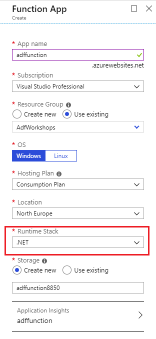
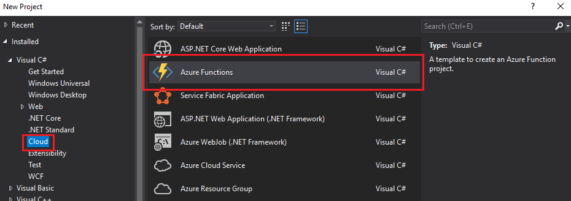
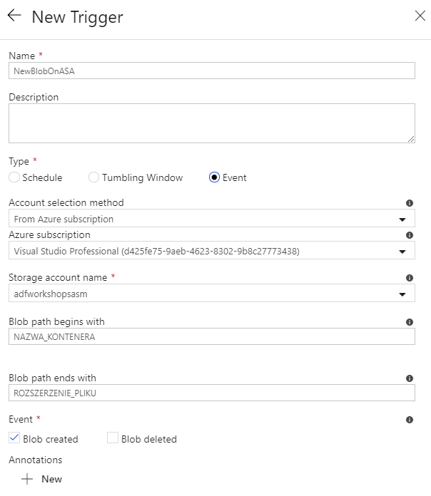
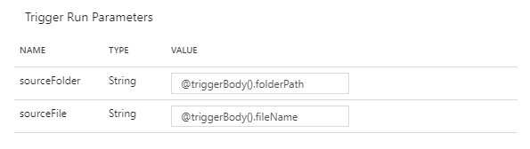
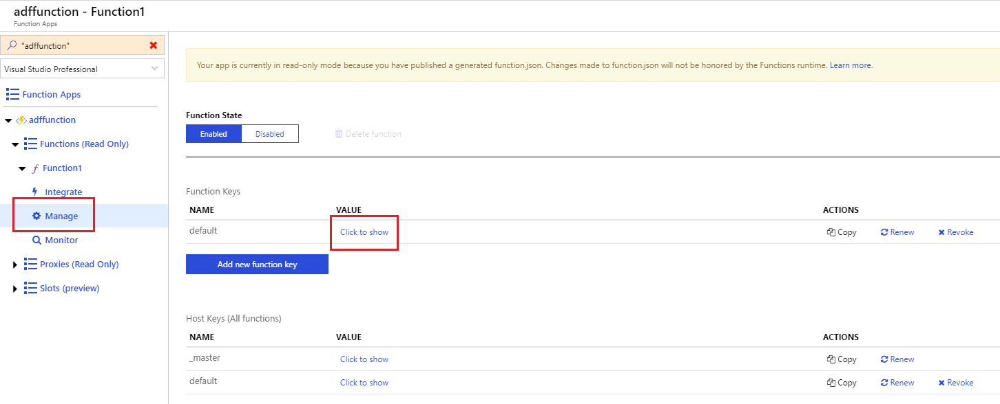
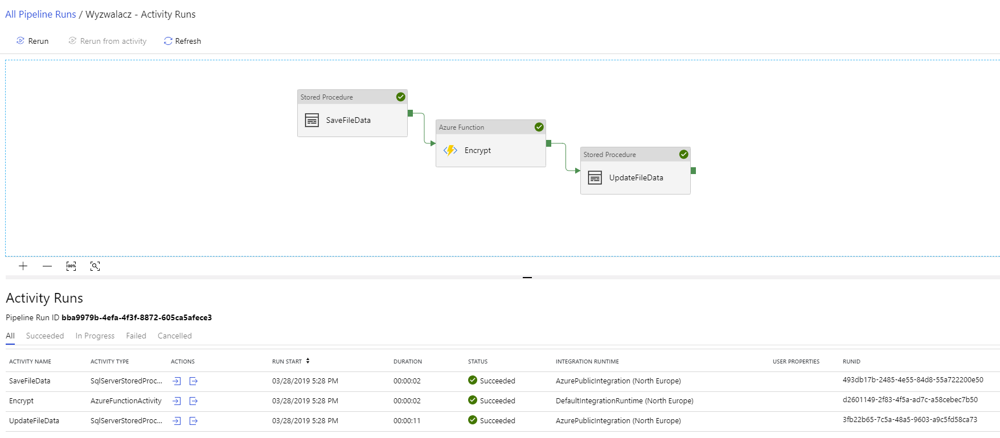

# Zadanie 3

## Stworzenie uslugi Event Grid

- Stwórz usługę Event Grid Topice
  - Azure -> Create a resource -> Event Grid Topic -> Create .


## Stworzenie usługi Function App

- Stwórz usługę Event Grid Topice
    - Azure -> Create a resource -> Compute -> Function App -> Create .

Z najważniejszych ustawień wybierz **Runtime Stack** jako **.NET**:



- Stwórz projekt Azure Functions za pomocą Visual Studio
  - File -> New -> Project -> Visual C# -> Cloud -> Azure Functions :



Jako wyzwalacz wybierz **Http trigger**. Następnie przeklej poniższy kod do projektu:

```c#
public static async Task<JObject> Run([HttpTrigger(AuthorizationLevel.Function, "post", Route = null)]HttpRequest req, TraceWriter log)
{
    // getting data from request's body
    const string destination = "encrypted";
    const string storageConnection = "PUT_CONNECTIONSTRING_HERE";
    var requestBody = new StreamReader(req.Body).ReadToEnd();
    dynamic data = JsonConvert.DeserializeObject(requestBody);
    string directory = data.directory;
    string filename = data.filename;
    string ciphertext;

    log.Info($"Source directory: {directory}");
    log.Info($"Filename to encrypt: {filename}");

    // downloading blobs content
    var cloudStorageAccount = CloudStorageAccount.Parse(storageConnection);
    var cloudBlobClient = cloudStorageAccount.CreateCloudBlobClient();
    var cloudBlobContainer = cloudBlobClient.GetContainerReference(directory);
    var cloudBlockBlob = cloudBlobContainer.GetBlockBlobReference(filename);
    var plaintext = await cloudBlockBlob.DownloadTextAsync();

    // encrypting message using AES
    using (var aes = new RijndaelManaged())
    {
        aes.GenerateKey();
        aes.GenerateIV();
        var encrypted = EncryptStringToBytes(plaintext, aes.Key, aes.IV);
        var sb = new StringBuilder();
        foreach (var item in encrypted)
        {
            sb.Append(item.ToString("X2") + " ");
        }

        ciphertext = sb.ToString();
    }

    // saving ciphertexts in blob
    var container = cloudBlobClient.GetContainerReference(destination);
    var blockBlob = container.GetBlockBlobReference(filename);
    
    await container.CreateIfNotExistsAsync();
    await blockBlob.UploadTextAsync(ciphertext);
    return new JObject { new JProperty("Status", "OK") };
}

private static byte[] EncryptStringToBytes(string plainText, byte[] key, byte[] iv)
{
    byte[] encrypted;
    using (var rijAlg = new RijndaelManaged())
    {
        rijAlg.Key = key;
        rijAlg.IV = iv;

        var encryptor = rijAlg.CreateEncryptor(rijAlg.Key, rijAlg.IV);
        using (var msEncrypt = new MemoryStream())
        {
            using (var csEncrypt = new CryptoStream(msEncrypt, encryptor, CryptoStreamMode.Write))
            {
                using (var swEncrypt = new StreamWriter(csEncrypt))
                {
                    swEncrypt.Write(plainText);
                }

                encrypted = msEncrypt.ToArray();
            }
        }
    }

    return encrypted;
}
```

Zaimportuj niezbędne biblioteki, a następnie zbuduj projekt. Jeśli wszystko zakończy się powodzeniem kliknij prawym przyciskiem myszy na nazwę projektu w **Solution Explorerze** i wybierz opcję **Publish**. W nowo otwartym oknie wybierz istniejący **App Service Plan**, a następnie wskaż na stworzony przed chwilą **Function App**. Funkcja powina zostać pomyślnie zdeployowana na chmurę.

**Pamiętaj o wprowadzeniu poprawnego ConnectionString'a magazynu danych!**

## Dodanie wyzwalacza
W kreatorze Data Factory UI dodajemy nowy potok. Aby dodać jakiekolwiek parametry potoku klikamy w dowolnym miejscu workspace (poza jakimkolwiek activity), a następnie wybieramy zakładkę **Parameters**. Następnie dodajemy dwa parametry:

- sourceFolder, typu String,
- sourceFile, również typu String.

Teraz aby dodać nowy wyzwalacz klikamy w przycisk **Add trigger**. Jak typ wybieramy **Event**, po czym wskazujemy magazyn danych, na którym będziemy nasłuchiwać. W polach **Blob path begins with** oraz **Blob path ends with** należy określić format oraz lokalizację plików, których pojawienie się będzie uruchamiać potok.



Teraz przechodzimy do konfiguracji parametrów potoku. Na podstawie zdarzenia jesteśmy w stanie wyciągnąć kilka informacji dotycych samego bloba:



## Rejestracja pliku w bazie danych
Przykładowe skrypty tworzące odpowiednią tabelę i procedurę składowaną na bazie:

```sql
CREATE TABLE [dbo].[Files]
(
	[Id] INT IDENTITY(1,1),
	[Filename] VARCHAR(255) NULL,
	[Created] DATETIME NULL,
	[In_Progress] BIT NULL,
	[Completed] BIT NULL
)
```

```sql
CREATE PROCEDURE [usp_InsertFileData] 
(
    @filename VARCHAR(1024)
)
AS
BEGIN
	INSERT INTO [dbo].[Files] 
	(Filename, Created, In_Progress, Completed)
	VALUES (@filename, GETDATE(), 1, 0)
END
```

Jeżeli chcesz wywołać dowolny kod SQL dodaj do potoku activity o nazwie **Stored Procedure**, znajdziesz je rozwijając zakładkę **General**. Następnie dodaj nowy **Linked Service** odwołujący się do procedury **usp_InsertFileData**.

## Uruchomienie procesu szyfrującego
Dodaj do projektu kolejny activity, pozwalający na uruchamianie funkcji Azure'owych. Podczas konfiguracji nowego **Linked Service'u** dla **Azure Functions** konieczne będzie podanie tzw. **Function Key**. Znajdziesz go przeglądając sekcję **Manage** w ustawieniach usługi **Azure Functions** na portalu:



Jako metodę wykorzystywaną przez Azure Functions activity wybierz **POST**. Konieczna będzie jeszcze konfiguracja parametru **body**. Klikając w pole powinna stać się widoczny link z napisem **Add dynamic content**. Wybierając tą opcję zostaniemy przeniesieni do specjalnego edytora w ramach którego będziemy w stanie zparametryzować treść naszego **body**. Jako wartość ustaw poniższy json:

```
@concat(
'{ ',
'"directory": "', pipeline().parameters.sourceFolder, '",',
'"filename": "', pipeline().parameters.sourceFile, '"',
'}'
)
```

Dzięki tej konstrukcji parametry potoku zostaną przekazane POST'em do funkcji. W tym momencie można połączyć dwa activity ze sobą.

## Aktualizacja stanu szyfrowania plików

W ramach tego zadania należy dodać dodatkowe activity uruchamiające procedurę aktualizacji flag **In_progress** oraz **Completed**, podobnie jak to miało miejsce przy pierwszym activity.

Kompletny potok powinien wyglądać następująco:


