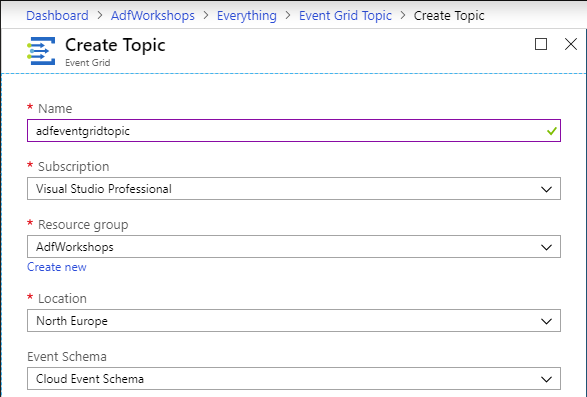
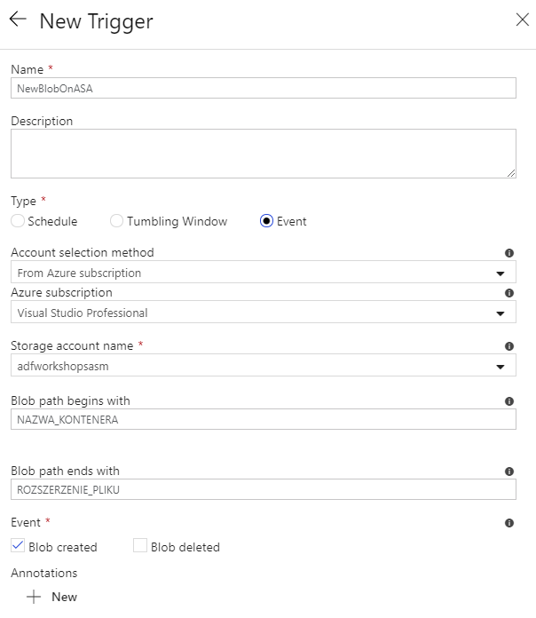

# Zadanie 3

## Stworzenie uslugi Event Grid

- Stwórz usługę Event Grid Topice
  - Azure -> Create a resource -> Event Grid Topic -> Create .



## Stworzenie uslugi Function App

## Dodanie wyzwalacza
W kreatorze Data Factory UI dodajemy nowy potok. Aby dodać jakiekolwiek parametry potoku klikamy w dowolnym miejscu workspace (poza jakimkolwiek activity), a następnie wybieramy zakładkę **Parameters**. Następnie dodajemy dwa parametry:

- sourceFolder, typu String,
- sourceFile, również typu String.

Teraz aby dodać nowy wyzwalacz klikamy w przycisk **Add trigger**. Jak typ wybieramy **Event**, po czym wskazujemy magazyn danych, na którym będziemy nasłuchiwać. W polach **Blob path begins with** oraz **Blob path ends with** należy określić format oraz lokalizację plików, których pojawienie się będzie uruchamiać potok.



Teraz przechodzimy do konfiguracji parametrów potoku. Na podstawie zdarzenia jesteśmy w stanie wyciągnąć kilka informacji dotycych samego bloba:


## Rejestracja pliku w bazie danych
Przykładowe skrypty tworzące odpowiednią tabelę i procedurę składowaną na bazie:

```sql
CREATE TABLE [dbo].[Files]
(
	[Id] INT IDENTITY(1,1),
	[Filename] VARCHAR(255) NULL,
	[Created] DATETIME NULL,
	[In_Progress] BIT NULL,
	[Completed] BIT NULL
)
```

```sql
CREATE PROCEDURE [usp_InsertFileData] 
(
    @filename VARCHAR(1024)
)
AS
BEGIN
	INSERT INTO [dbo].[Files] 
	(Filename, Created, In_Progress, Completed)
	VALUES (@filename, GETDATE(), 1, 0)
END
```

Jeżeli chcesz wywołać dowolny kod SQL dodaj do potoku activity o nazwie **Stored Procedure**, znajdziesz je rozwijając zakładkę **General**. Następnie dodaj nowy **Linked Service** odwołujący się do procedury **usp_InsertFileData**.

