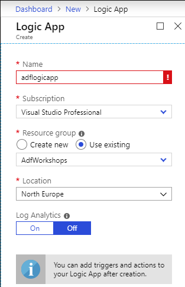
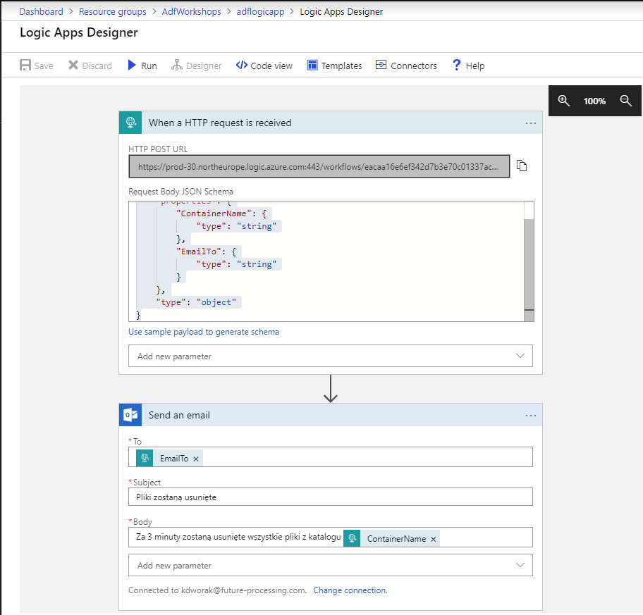
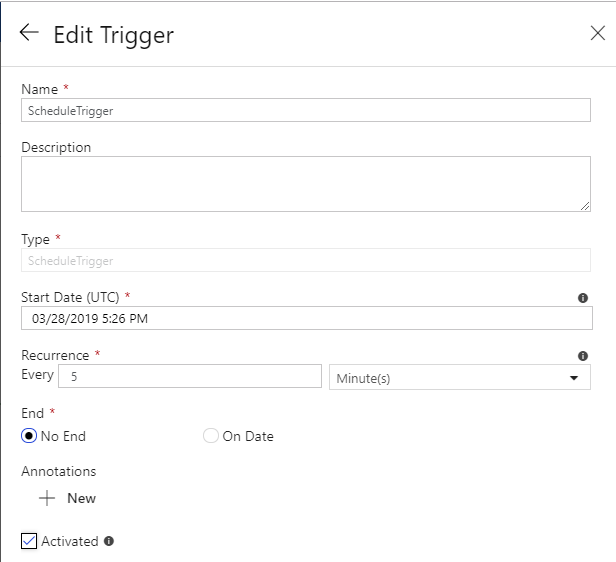
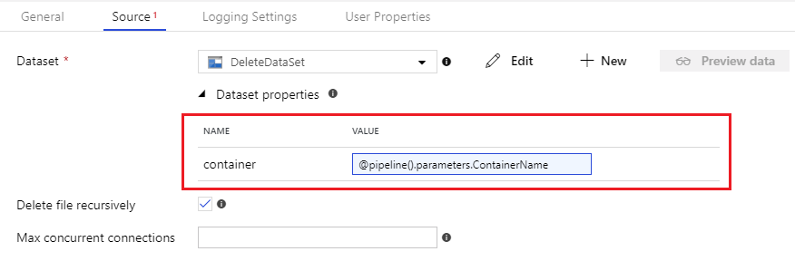
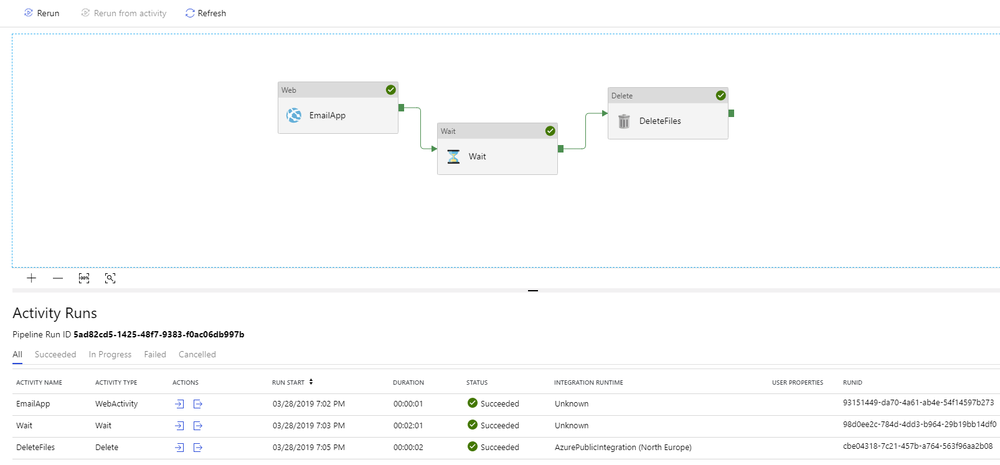

# Zadanie 4

## Stworzenie usługi Logic App

- Stwórz usługę Logic App
  - Azure -> Create a resource -> Web -> Logic App -> Create .



Aplikacja powinna być uruchamiana wyzwalaczem **HTTP**. Po zatwierdzeniu zostanie załadowany **Logic App Designer** za pomocą którego zbudujemy prostą aplikację do wysyłania wiadomości email. Jako **Request Body JSON Schema** podaj:

```json
{
    "properties": {
        "ContainerName": {
            "type": "string"
        },
        "EmailTo": {
            "type": "string"
        }
    },
    "type": "object"
}
```

Schema ta określa jakie dane zostaną przesłane do aplikacji przez Data Factory. Po zapisie projektu powinien automatycznie wygenerować się link do aplikacji. Następnie przechodzimy do dodania następnego kroku. Z listy dostępnych szablonów znajdź szablon odpowiedzialny za wysyłanie email - konieczna może być integracja z dowolnym serwerem poczty email. Nastepnie jesteśmy w stanie skonstruować prostą wiadomość za pomocą przedstawionego kreatora:



Możesz skorzystać z zdefiniowanych w **request body** wartości w celu parametryzacji wybranych pól.

## Konfiguracja harmonogramu

Wracamy do kreatora Azure Data Factory. Zanim stworzymy harmonogram zacznijmy od dodania dwóch parametrów dla pipeline'u:

- ContainerName, typu String, 
- EmailTo, również typu String.


 Aby dodać nowy scheduler ponownie klikamy w przycisk **Add triger**. Teraz tworzymy nowy wyzwalacz, aczkolwiek tym razem jako typ wybieramy **Schedule**. Przykładowa konfiguracja:



Następnie zostaniemy poproszeni o podanie wartości zdefiniowanych wcześniej parametrów. Jako **ContainerName** podaj katalog **toencrypt**,natomiast jako **EmailTo** swój adres email.

## Integracja logic app z Azure Data Factory

Aby zintegrować nasz pipeline z aplikacją logic app dodajemy do projektu **Web activity**, dostępne wewnątrz sekcji **General**. W zakładce **Settings** podajemy **URL** aplikacji (znajdziesz go w designerze logic apps), natomiast jako metodę ustawiamy **POST**. Body możemy po raz kolejny wygenerować za pomocą polecenia **Add dynamic content**. Przykładowa zawartość może wyglądać następująco:

```
@concat(
'{ ',
'"ContainerName": "', pipeline().parameters.ContainerName, '",',
'"EmailTo": "', pipeline().parameters.EmailTo, '"',
'}'
)
```

## Aktywne czekanie

2 minuty przed usunięciem danych użytkownik powinien zostać poinformowany. W tym celu dodaj do potoku activity **Wait** dostępne w sekcji **General**. W zakładce **Settings** znajdziesz pole definiujące liczbę sekund przez które pipeline będzie wstzymany.

## Usuwanie danych

Activity niezbędne do usuwania danych znajdziesz w sekcji **Move & Transform**. Koniecznym może być dodanie nowego datasetu, wskazującego na okpowiedni kontener mgazynu danych. Konfigurując dataset dodaj dodatkowy parametr, który następnie można uzupełnić z poziomu pipeline'u:



W zakładce **Logging Settings** możesz dezaktywować logowanie. Uruchom pipeline ustawiając odpowiednia wartość w harmonogramie. Jeżeli wszystko zostało wykonane poprawnie Twój potok powinien wyglądać następująco:


