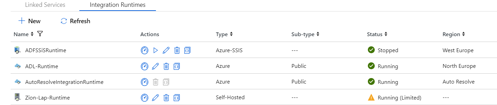
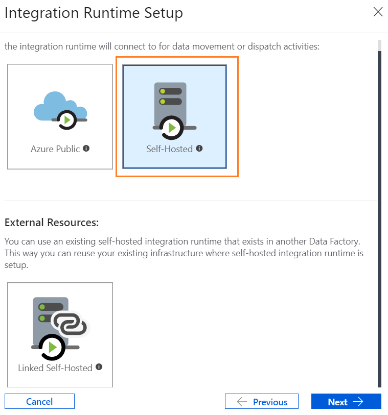
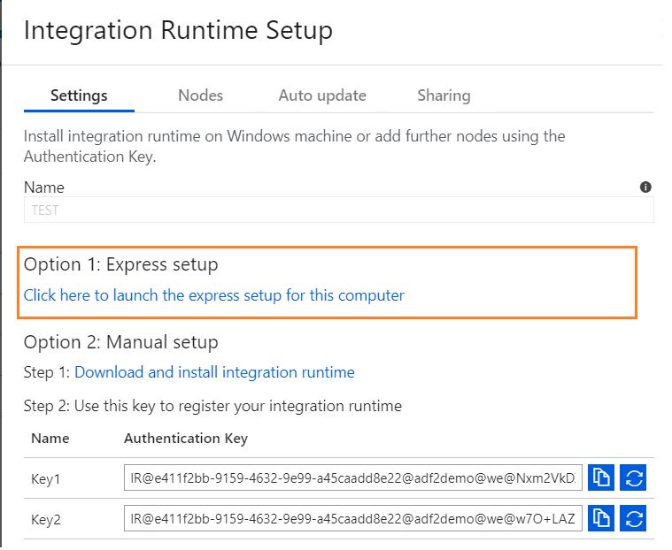
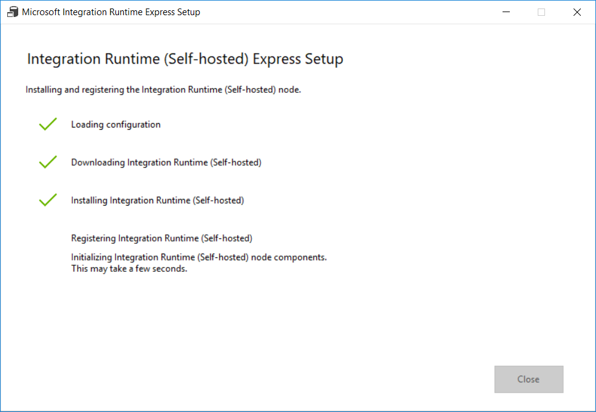
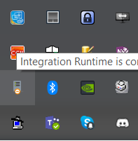
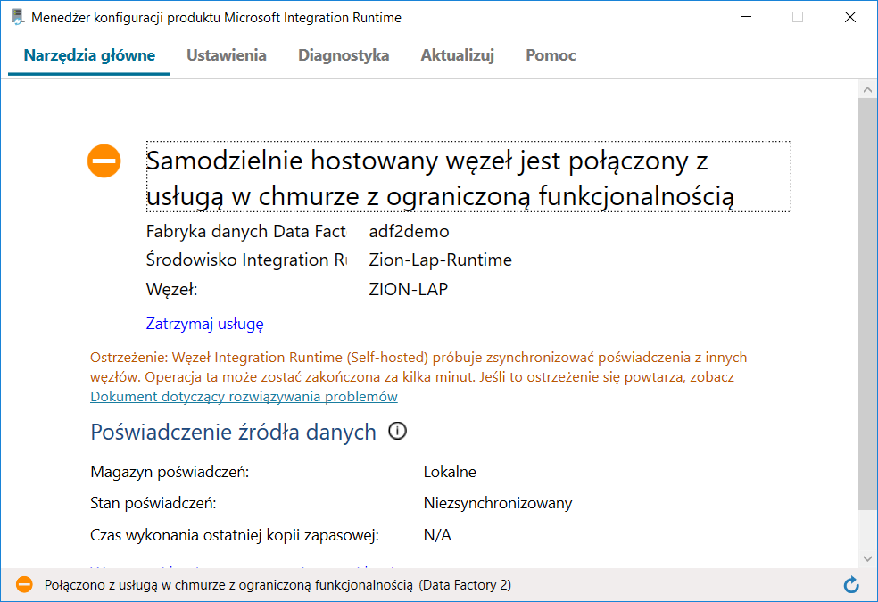

# Zadanie 5

## Konfiguracja ADF-Self Hosted IR

Aby mieć dostęp z poziomu portalu przechodzimy do **Connections** a następnie do **Integration Runtimes**

 

  

Następnie dodajemy nowy runtime poprzez New.

W kolejnym kroku wybieramy Integration Runtime: **Perform data movement and dispatch activities to external computes.** i następnie **Self-Hosted**

i podajemy nazwę Runtime np. MyMachineNameIR. Następnie możemy pobrać przygotowany instalator (lub użyć generycznego instalatora) aby zainstalować IR na lokalnej maszynie. Preferowana jest opcja pierwsza

### Nadawanie uprawnień dla Service Principal do Azure Data Lake

Po stworzeniu SP przejdź do usługi Azure Data Lake Analytics, aby nadać uprawnienia dla stworzonego SP.

Następnie uruchom Wizarda dodawania nowego użytkownika.

 Po pobraniu uruchamiamy instalator.

 

Po zainstalowaniu uruchamiamy Integration Runtime

I ewentualnie (jeśli usługa nie jest uruchomiona to) uruchamiamy usługę.

Czasami (jak widać na powyższym obrazku) usługa jest połączona z chmurą z ograniczoną funkcjonalnością - jest to "niedoskonałość usługi", która była zgłaszana do MS. 

W ostatnim kroku sprawdzamy stan usługi na portalu ADF

