# Zadanie 6

## Utworzenie usługi Azure Data Lake Analytics

- Uwtórz usługę Azure Data Lake Analytics 
  - Azure->Nowy-> Data Lake Analytics ->Uwtórz ( Usługa Azure Data Lake Analytics wymaga Azure Data Lake Store, jeśli ADLS został utworzony wcześniej może zostać wybrany istniejący, jeśli nie należy utworzyć ADLS podczas tworzenia ADLA)

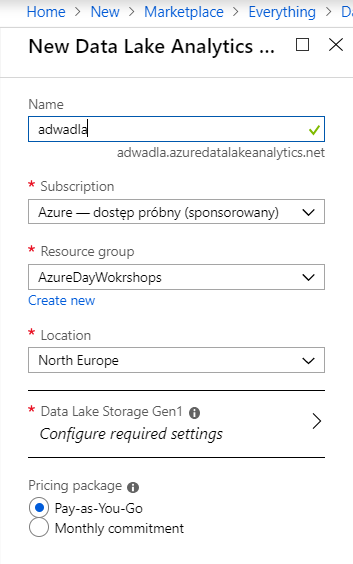
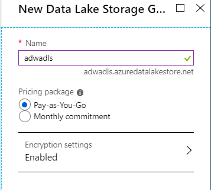

## Rejestrowanie rozszerzeń
W pierwszym kroku należy zarejestrować rozszerzenia dla U-SQL. Aby to zrobić należy z poziomu portalu Azure przejść do usługi Azure Data Lake Analytics. Następnie przejść do opcji **Sample Scripts** , a następnie do **Install U-SQL Extentions**

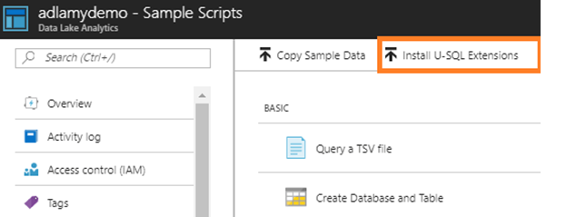

Po zainstalowaniu zainstalowaniu rozszerzeń na Azure Data Lake Store powinien powstać katalog usqlext.

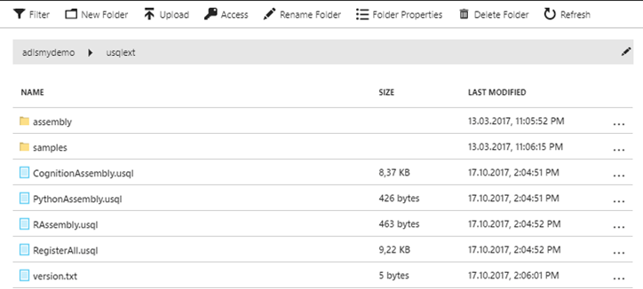

W kolejnym kroku należy zarejestrować rozszerzenia. W tym celu należy uruchomić skrypt RegisterAll.usql (typowy job U-SQL ADLU=1). Rozszerzenia zostaną zarejestrowane na bazie master.

Następnie należy skopiować pliki, dla których chcemy wykonać przetwarzania na ADLS i uruchomić skrypt


## Tworzenie Service Principal

Aby mieć dostęp z poziomu ADF zarówno do ADLS jak i ADLA należy najpierw stworzyć Service Principal.

Aby dodać Service Principal z poziomu portalu przechodzimy do opcji **Azure Active Directory->App registrations->App registrations**

 

  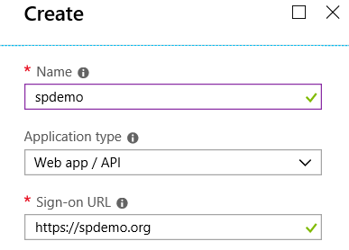

Po utworzeniu aplikacji skopiuj **Application ID** i przejdź do opcji **Settings** aby wygenerować klucz dostępu.

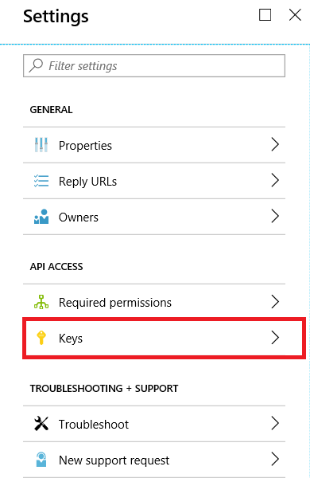

Następnie podaj nazwę klucza i czas obowiązywania. 

Po wygenerowaniu klucza zapisz go.

### Nadawanie uprawnień dla Service Principal do Azure Data Lake

Po stworzeniu SP przejdź do usługi Azure Data Lake Analytics, aby nadać uprawnienia dla stworzonego SP.

Następnie uruchom Wizarda dodawania nowego użytkownika.

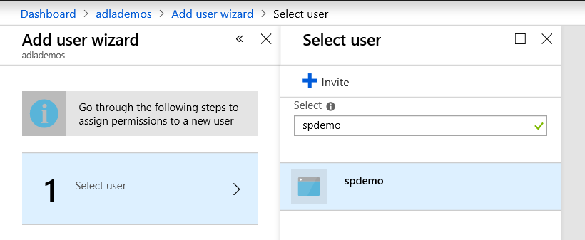

Wybierz:

-  rolę:Contributor 
- Select catalog permissions :Read and Write dla wszystkich obiektów
- Select file permissions: Read Write Execute oraz opcję This folder and all childern

Następnie Assign selected permissions i **Run**


#### Tworzenie połączenia do Azure Data Lake Store i Azure Data Lake Analytics

W poziomu edytora Azure Data Factory przejdź do opcji Connections

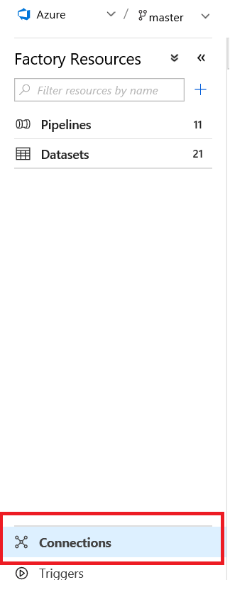

Następnie przejdź do opcji Linked Services i New. Następnie dodaj ADLS Service


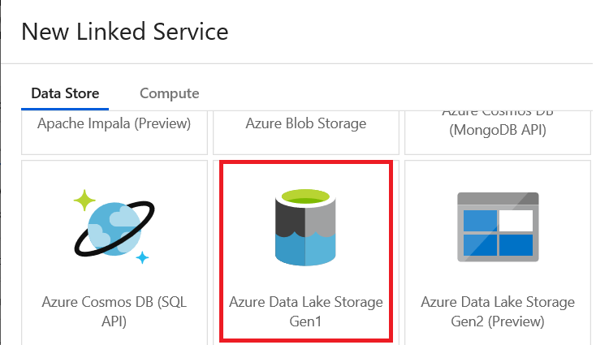

Wybierz usługę ADLS w ramach swojej subskrypcji i korzystając z wcześniej stworzonego Service Principal stwórz Linked Service od usługi Azure Data Lake Store.

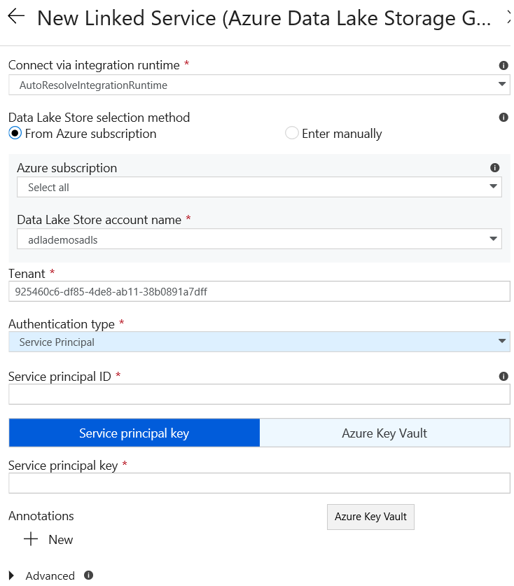

Następnie stwórz Linked Service do Azure Data Lake Analytics (Compute)- lista kroków analogiczna jak w przypadku ADLS.

### Tworzenie połączenia do lokalnego File Storage

Przejść do opcji dodawania nowego Linked Service z poziomu portalu usługi Azure Data Factory

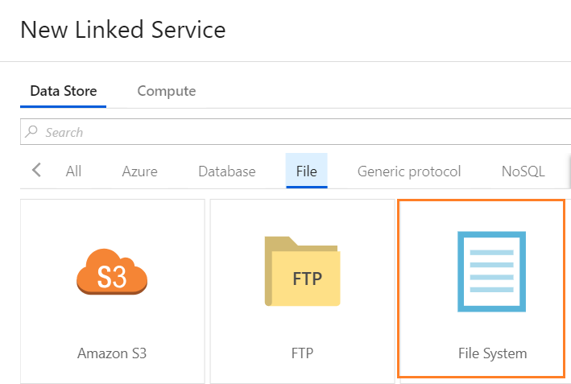

Podaj parametry połączenia (należy wybrać IR -wcześniej stworzony Self-Hosted-Integration Runtime)

oraz podać login i hasło, dla użytkownika (lokalny lub domenowy) który będzie miał dostęp do lokalnych zasobów

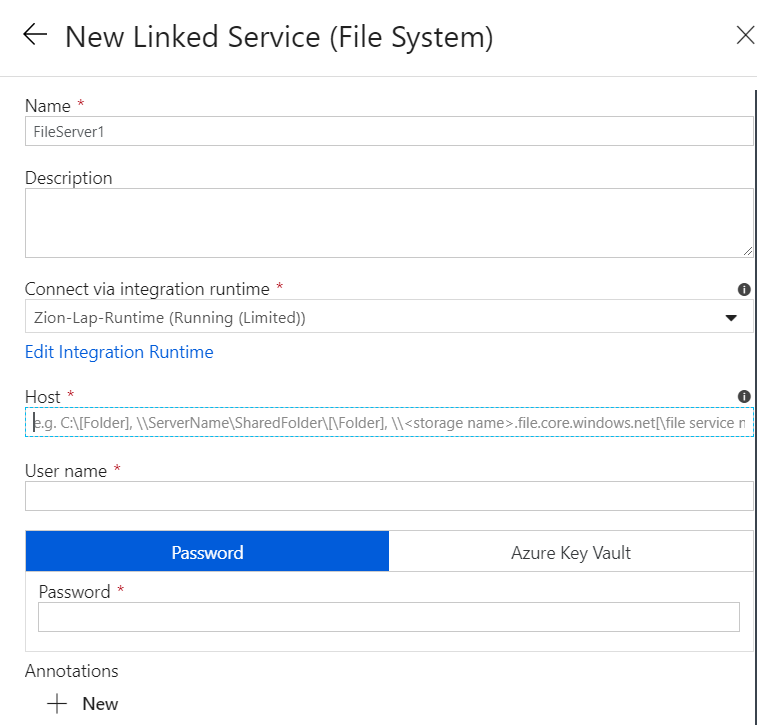

### Kopiowanie plików z lokalnego File Storage do ADLS

W tym celu należy utworzyć nowy pipeline na ADF oraz użyć CopyActivity. Należy stworzyć dwa DataSets - jeden reprezentujący pliki na lokalnym komputrze (zaznaczyć własność BinaryCopy), a drugi reprezentujący dane docelowe na ADLS. Następnie skonfigurować CopyActity tak, aby kopiowała pliki (binarne), bez mappingu do ADLS i uruchomić pipeline.

### Przetwarzanie plików na Azure Data Lake Analytics

W tym celu należy dodać kolejne Activity U-SQL ( oraz ADLA jako linked Service), (ilość ADLA =1)

Skrypt:

```sql
USE [master];
REFERENCE ASSEMBLY ImageCommon;
REFERENCE ASSEMBLY ImageTagging;

DECLARE @basePath string = @"/Images";
DECLARE @input string = @basePath + "/{FileName}";
DECLARE @output string = @basePath + @"/output/objects.csv";


///Extract images
@imgs =
    EXTRACT FileName string,
            ImgData byte[]
    FROM @input
    USING new Cognition.Vision.ImageExtractor();

//// Extract the number of objects on each image and tag them 
@objects =
    PROCESS @imgs 
    PRODUCE FileName,
            NumObjects int,
            Tags SQL.MAP<string, float?>
    READONLY FileName
    USING new Cognition.Vision.ImageTagger();

//// Transform to table:
///  FileName tag1
///  FileName tag2
///  FileName tag3

@objects =
    SELECT o.FileName,
           t.Tag,
           t.Conf
    FROM @objects AS o
         CROSS APPLY
             EXPLODE(o.Tags) AS t(Tag,Conf);

OUTPUT @objects
TO @output
ORDER BY FileName
USING Outputters.Csv(outputHeader:true);

```

Jeśli do skryptu U-SQL chcemy dodać parametry z poziomu ADF to  ich deklaracje należy usunąć z skryptu

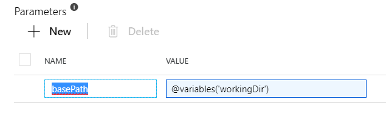 

Czyli jeżeli dodajemy parametr basePath to musimy go usunąć z skryptu (DECLARE @basePath...)

Po uruchomieniu pipeline pliki powinny zostać pobrane do ADLS, następnie powinien zostać uruchomiony job ADLA, którego wynikiem powinien być plik na ADLS.

### Ładowanie wyników do lokalnej bazy danych

W pierwszym kroku należy na lokalnym serwerze SQL utworzyć bazę danych, następnie tabele

```sql
CREATE TABLE [dbo].[ImageObjects]
(
	[Id] INT NOT NULL IDENTITY(1,1) PRIMARY KEY,
	[TimeStamp] DATETIME2(7) DEFAULT SYSDATETIME(),
	[FileName] VARCHAR(255) NOT NULL,
	[Object]  VARCHAR(255) NOT NULL,
	[Conf] FLOAT NOT NULL
)
```

Następnie z poziomu portalu ADF, tworzymy Linked Service do naszego MSSQL (używamy SelfHosted IR) i DataSet do naszej tabeli. W przypadku DataSets pobieramy (Importujemy schemat) i usuwamy z niego kolumne Id.

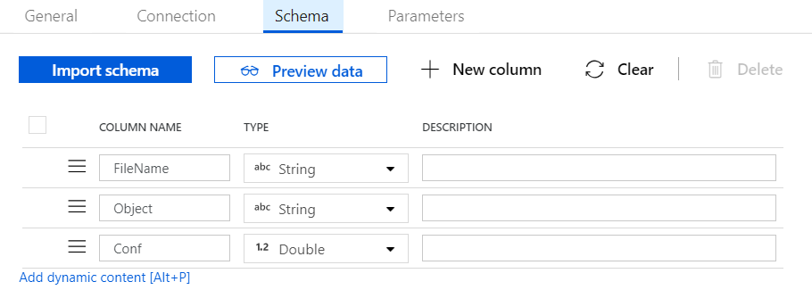

Następnie tworzymy DataSet dla wyników przetwarzania ADLA - plik na ADLS.

W kolejnym kroku dodajemy do naszego pipeline kolejne CopyActivity i jako Source wybieramy plik z ADLS (wynik przetwarzania) a Sink -tabele w bazie danych. Konfigurujemy mapping i uruchamiamy cały pipeline.

Po uruchomieniu wyniki przetwarzania powinny zostać załadowane do tabeli w bazie.