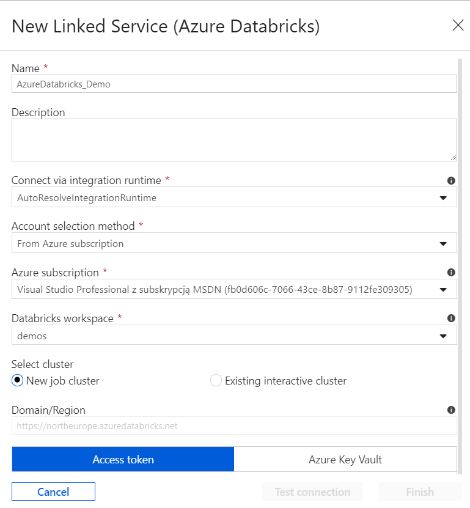
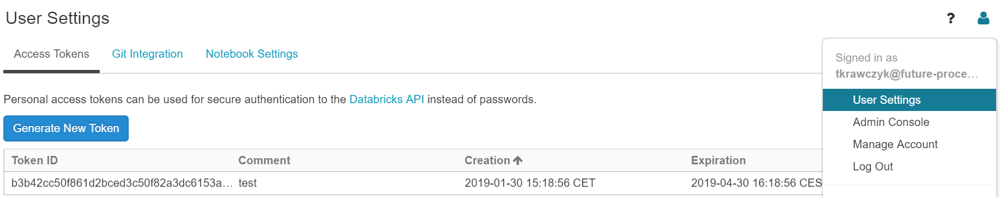
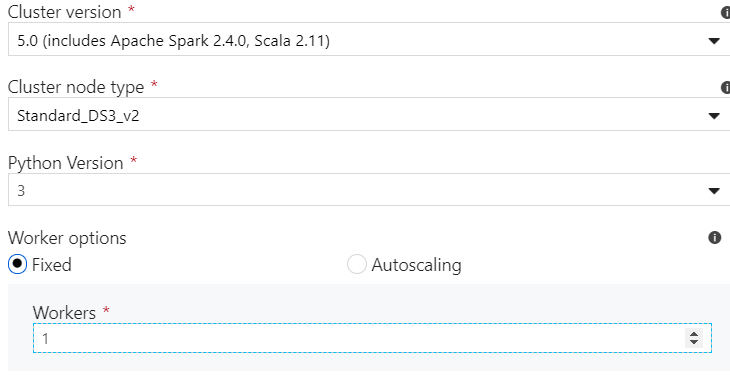
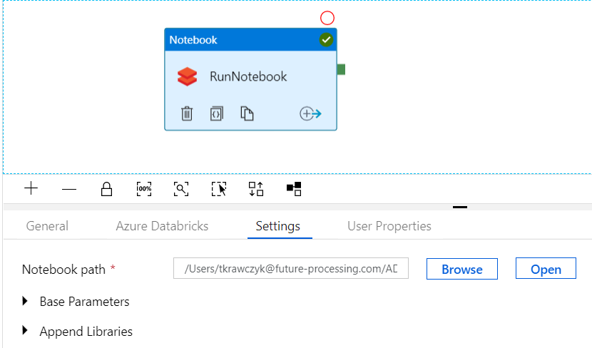
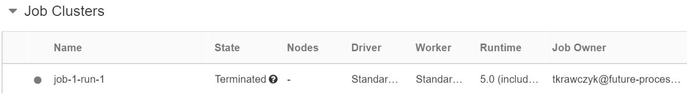

# Zadanie 7

W pierwszym, kroku należy stworzyć usługę Azure Databricks i otworzyć Workspace.

Następnie należy utworzyć Notebook (Python)

```python
spark.conf.set("dfs.adls.oauth2.access.token.provider.type", "ClientCredential")
spark.conf.set("dfs.adls.oauth2.client.id", "<ServicePrincipalId>")
spark.conf.set("dfs.adls.oauth2.credential", "<ServicePrincipalKey>")
spark.conf.set("dfs.adls.oauth2.refresh.url", "https://login.microsoftonline.com/<DirectoryId/Tenant>/oauth2/token")
spark.conf.set("spark.sql.shuffle.partitions", "1")
```
```python
%sql
DROP TABLE IF EXISTS Parking;
CREATE TEMPORARY TABLE Parking
    USING com.databricks.spark.csv
    OPTIONS (path 'adl://adlademosadls.azuredatalakestore.net/mySamples/Parking/data.csv', header 'true');
```
```python
resultPath ="adl://adlademosadls.azuredatalakestore.net/mySamples/Parking/Results/"
dbutils.fs.rm(resultPath,recurse= True)
usage = sqlContext.sql('SELECT SystemCodeNumber'
                       ',to_date(LastUpdated) AS Date'
                      ',MAX(Occupancy) *100/MAX(Capacity) AS Usage '
                      'FROM Parking '
                      'GROUP BY SystemCodeNumber,to_date(LastUpdated) '
                      'ORDER BY SystemCodeNumber,to_date(LastUpdated)')
usage.write.option('sep',',').option('header','true').format('com.databricks.spark.csv').save(resultPath)
```

Po utworzeniu notebook należy ustawić poprawne dane uwierzytelniające do ADLS oraz ścieżki zarówno do pliki z danymi, jak i z wynikami przetwarzania.

Następnie na ADF należy stworzyć nowy pipeline a w nim Databricks\Notebook Activity. Po utworzeniu Activity tworzymy nowy Linked Service dla Azure Databricks



Aby utworzyć nowe Linked Service należy wybrać subskrypcje na której wcześniej utworzyliśmy Azure Databrick oraz stworzony wcześniej Azure Databricks Workspace oraz Access token. Aby stworzyć nowy Access Token z poziomu  Azure Databricks Workspace, wybieramy Opcje użytkownika a następnie User Settings->Generate New Token.



Po wygenerowaniu tokenu, z poziomu konfiguracji ADF możemy wybrać parametry klastra.



Po skonfigurowaniu klastra, w naszym Activity wybieramy stworzony wcześniej Notebook 



Następnie uruchamiamy Pipeline i przechodzimy do usługi Azure Databricks->Clusters. Powinien się tam uruchomić nowy Job 



